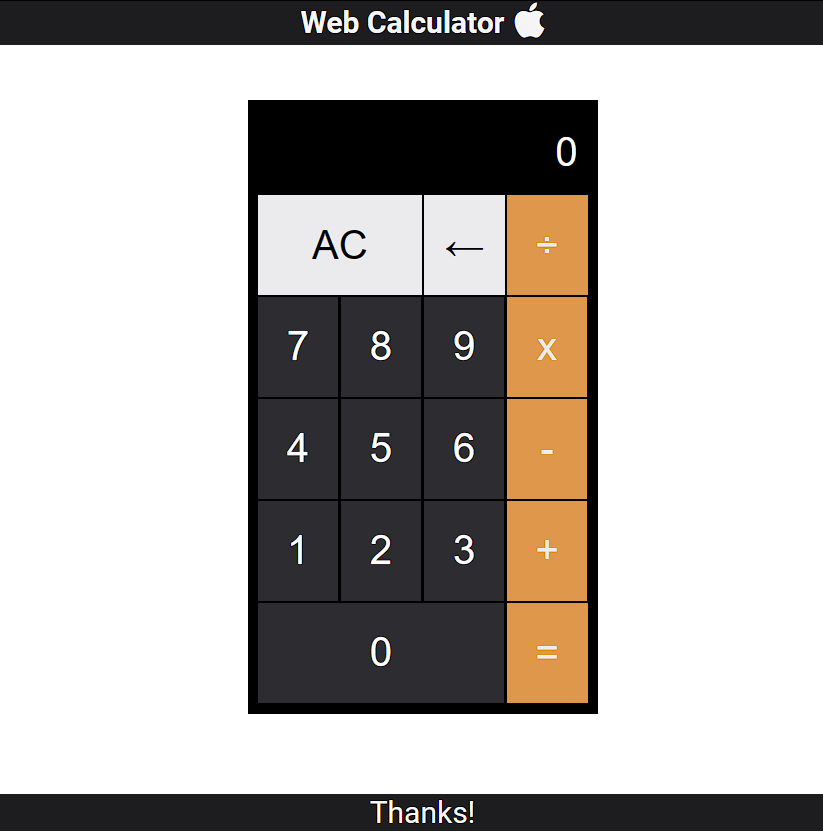

# web-calculator

<h1 align="center">
  <br/>
  WEB calculator
</h1>

<p align="center">
  

  
  
  <a href="https://github.com/LucasPereiraMiranda/web-calculator/commits/master">
    
  </a>

  <a href="https://github.com/LucasPereiraMiranda/web-calculator/issues">
    
  </a>

  <a href="https://github.com/LucasPereiraMiranda/web-calculator/issues">
    
  </a>
</p>

<br>

---

## 🚀 Techs

WEB calculator app was developed with these technologies

- [HTML](https://developer.mozilla.org/en-US/docs/Web/HTML)
- [CSS](https://developer.mozilla.org/en-US/docs/Web/CSS)
- [Javascript](https://developer.mozilla.org/en-US/docs/Web/JavaScript)

## 💻 Project

A project maded with HTML, CSS and pure Javascript with the intention of practicing the fundaments of web development.
I learned to build this calculator online as exercise in frontendmasters web course.
https://frontendmasters.com/

## 💻 preview

Deploy[URL](https://lucaspereiramiranda.github.io/web-calculator/)

<h1 align="center">
    
</h1>

## :boom: Installation

```bash
# Clone this repo
$ https://github.com/LucasPereiraMiranda/web-calculator


$ execute on browser or with live server

```

---
